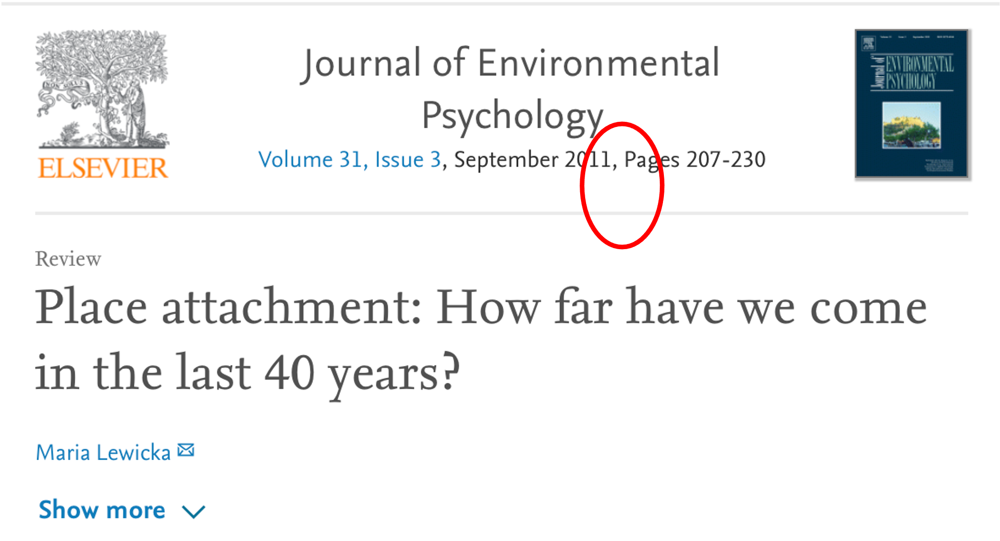
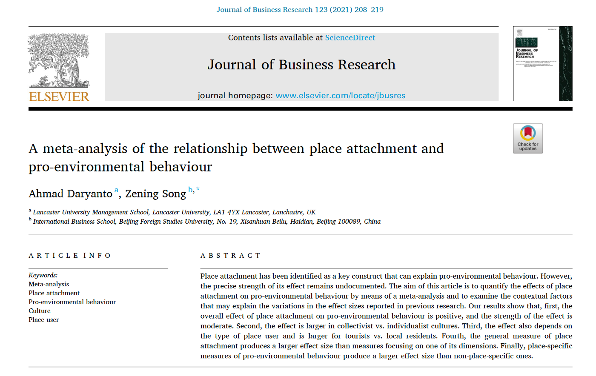
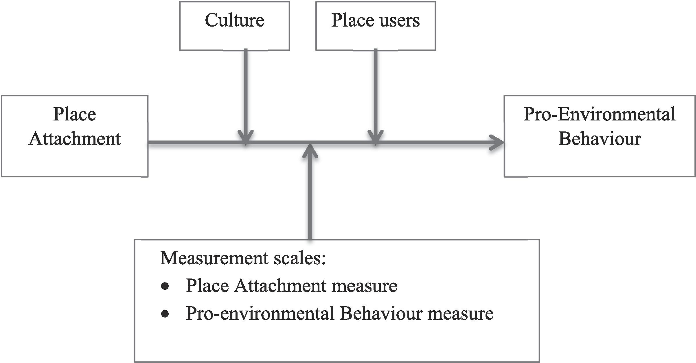
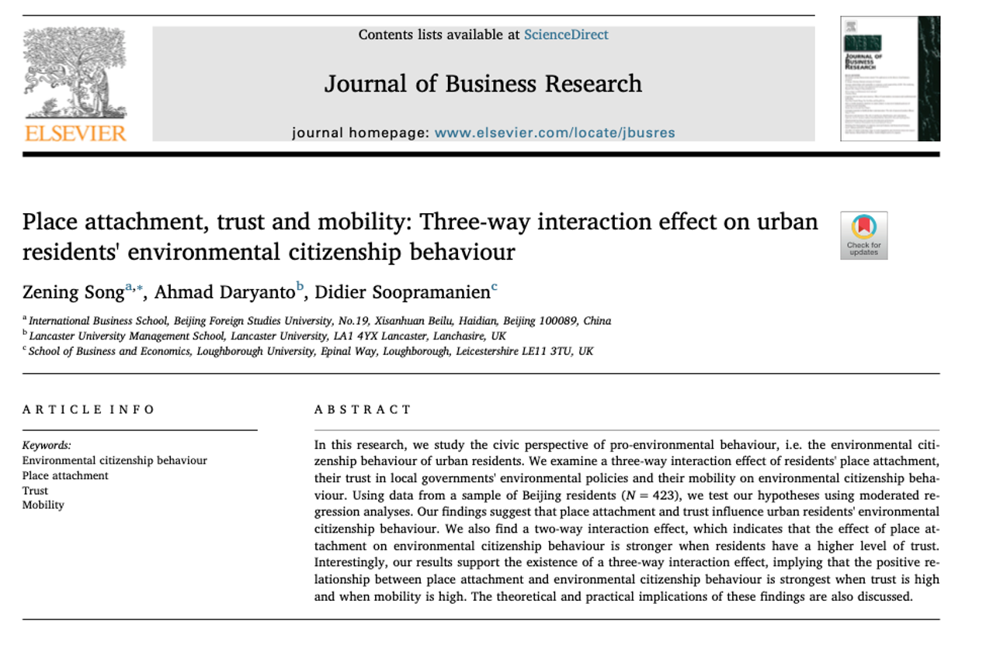
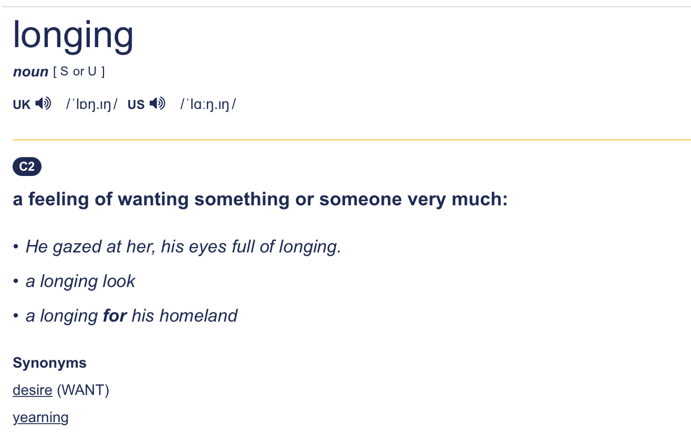
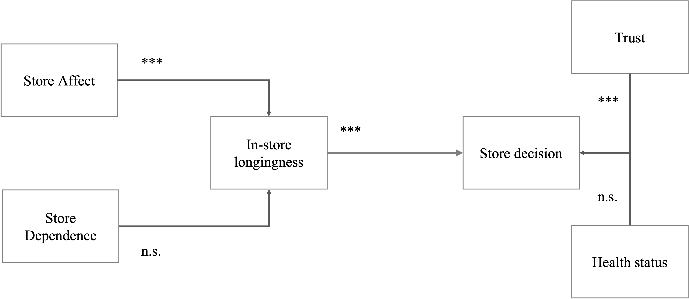

class: center

# Working paper

Store Attachment, Longingness for In-store Shopping, and Store Decision during the COVID-19 Pandemic 

Authors: Ahmad Daryanto <sup>a</sup> and Zening Song <sup>b</sup>

<sup>a</sup> Lancaster University, <sup>b</sup> Beijing Foreign Studies University

Main objective: how the COVID-19 pandemic affects shoppers’ emotional relationship with offline stores

-- under reviewed at a marketing journal

---
# Background
  
* Pandemic changes: what we buy and the way we shop

  ** Reduce store experience (less touch and feel) 
  
  ** Reduce pleasure (less browsing)
  
  ** Reduce interaction with store employees, shop assistants
  
  ** Anxiety during shopping increases
  
  ** More pro-environmental behaviours (?), permanent changes(?)
  
---
# Key idea  

Consumers have a sense of attachment with offline stores

  ** Underlying theory: Place attachment
  
  ** Attachment to a store might change 
  
    + level of attachment changes
    
    + forms of attachment changes (detachment, re-attachment, confinement)
  
  
```{r, out.width = "200px", echo=FALSE, fig.align='right', include=TRUE}
knitr::include_graphics("https://funsizedcomics.files.wordpress.com/2011/07/episode15.jpg")
```
---

## Place attachment

* Place attachment: the positive bonds that people have with a place

  + Place: residential areas, city, workplace, shopping mall, even an airport.

* Accumulation of experience in a place creates meaning: “it is not simply the places themselves that are significant, but rather what can be called ‘experience-in-place” (Manzo, 2005)

* If you are attached to a place, you will engage in behaviours that will benefit that place

---
## Dimensions of place attachment

* Identity 
  + e.g., “Living in City X says a lot about who I am” 

* Affect 
  + e.g., “I feel a strong sense of belonging to City X”

* Dependency 
  + e.g., For my work and life, I could not imagine anything better than the resources and facilities provided by City X

* Social bonds 
  + e.g., If I were to stop living in City X, I would lose contact with a number of friends 


---

## Place attachment

Appear in 120+ journals

Geography, Sociology, Environmental Psychology, 

Demography, urban studies, etc.

```{r, out.width = "600px", echo=FALSE}
 
```
---
## Place attachment

Systematic review on PA

```{r, out.width = "600px", echo=FALSE}
 
```

---
## Meta-analysis model

Number of studies = 38

Number of effect sizes (correlation coefficient), n = 124


```{r, out.width = "600px", echo=FALSE}
 
```

---
# Place attachment

```{r, out.width = "600px", echo=FALSE}
 
```

---

# Research questions

Do consumers miss pre-pandemic in-store experience?

New conceptualization is needed: in-store shopping longingness (ISL)

```{r, out.width = "600px", echo=FALSE}
 
```
---
# Why (in-store shopping) longingness?

* Reflect on feeling of nostalgic about pre-pandemic shopping

* Nostalgic feelings can be positive

 + positively related to optimism and positive health behaviours (Kersten, Cox and Van Enkevort 2016)

 + may have a positive impact on **store decision**
 
e.g., 
+ I only go to stores with solid anti-pandemic regulations
+ I will only go to the stores where the store assistants wear face masks properly.

 
 
---
# Research prepositions:

- Store affect has a positive impact on ISL

- Store dependence has a positive impact on ISL

- ISL has a positive impact on safety considerations in store choice decisions


---
# Methods

Online survey, Collected in China, multiple studies (4 studies)

Scale development process

* Qualitative: Preliminary study (N = 20)

* Quantitative: 

  ** item purification (N = 373, CFA)
  
  ** scale validation (N = 318, CFA, 6 items)
  
  ** main study (N = 420, SEM)

---
# Qualitative study

## Quotes from interviews

* “I do not do in-store shopping now due to the pandemic, and I miss it.”

* “I hope the pandemic can end soon and we can go to shops and malls like before.

* I really miss the relaxing atmosphere where I could enjoy myself in the stores.”

* “I went in-store shopping almost every week before the pandemic, and it was a good way to relax. Sometimes I could find some interesting stuff to buy when I was wondering freely in the stores.”

* “We cannot go to stores like before the pandemic since it is not safe. Of course I miss the in-store shopping we used to have.”
---

# ISL scale

6-items. 
Short, easy to administer

Good internal validity.

Sample items:

* I miss the freedom I had while shopping in store

* I miss the pleasures when shopping in store

* I miss the relaxing feelings I had when I were in-store

---
class: center

# Nomological network

```{r, out.width = "600px", echo=FALSE}
 
```

---
# Discussion

* Offline shopping and In-store longingness (ISL)

 ** online shopping compensates the longingness for offline shopping?

* Moving beyond pandemic

  ** can ISL capture a much larger phenomenon? 
  
  ** e.g., freedom restrictions such as illness, relocation

* Generalizability

  ** Testing the scale in other countries

---
class: center, middle

THANK YOU

---

